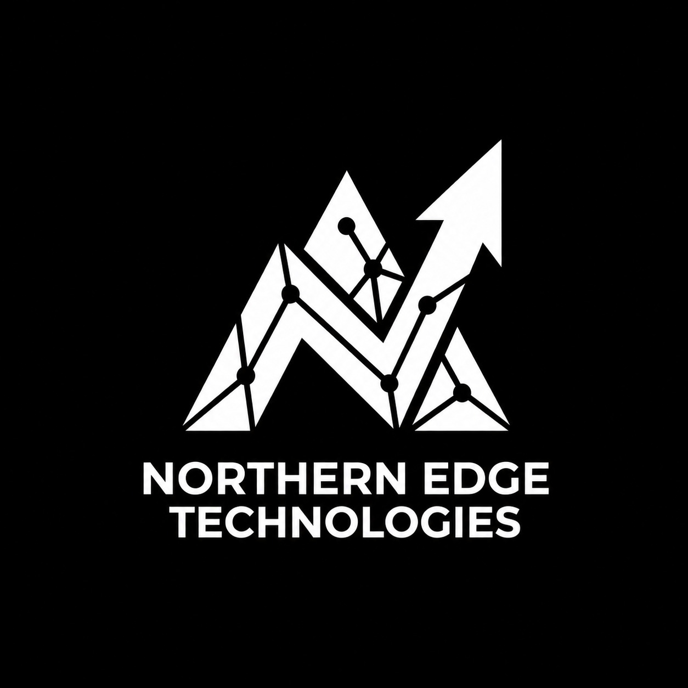

<div align="center">
  <a href="https://github.com/northern-edge-technologies/" target="_blank">
<picture>
  <source
    media="(prefers-color-scheme: dark)"
    srcset="./assets/solid-logo-full-white.png"
  />
  

</picture>
  </a>
</div>

<br/>

# Northern Edge Technologies

> **An engineering syndicate building scalable digital systems for businesses, governments, and modern enterprises.**

[northernedgetech.com](https://www.northernedgetech.com)

Northern Edge Technologies is an engineering and technology company focused on designing, building, deploying, and operating **scalable digital products and infrastructure**.

We work across complex domains including **GovTech, FinTech, Logistics, Biotechnology, AI, and enterprise software**, combining strong engineering practices with product thinking to build systems that can operate reliably in the real world.

---

## What We Build

Our engineering work spans the complete lifecycle of a digital product:

```text
Product Idea
    ↓
Requirements
    ↓
System Design
    ↓
Implementation
    ↓
Testing
    ↓
Deployment
    ↓
Observability
    ↓
Operations
    ↓
Continuous Improvement
```

Our focus is not simply on writing software.

We build systems that are:

* **Scalable** — capable of growing with the business
* **Reliable** — designed to behave predictably under failure
* **Secure** — protecting users, organizations, and sensitive data
* **Maintainable** — understandable and evolvable by other engineers
* **Observable** — measurable in production
* **Performant** — designed around real workload requirements
* **User-focused** — built around the problems the product actually solves

---

## Engineering Domains

### 🏛️ GovTech

We build technology that helps governments and public institutions modernize complex operational and regulatory processes.

This can include:

* Regulatory platforms
* Revenue and taxation systems
* Government integrations
* Data processing systems
* Reporting and reconciliation
* Digital public services

### 💳 FinTech

We engineer systems where **correctness, security, reliability, and throughput** are critical.

Areas include:

* Payment infrastructure
* Transaction processing
* Financial data pipelines
* Reconciliation
* Regulatory technology
* High-throughput financial systems

### 🚚 Logistics

We build systems that coordinate complex physical-world operations through software.

This includes:

* Operations platforms
* Tracking
* Scheduling
* Workflow automation
* Customer-facing applications
* Integrations

### 🤖 Artificial Intelligence

We explore and deploy AI systems that solve practical business problems rather than treating AI as an isolated feature.

This includes:

* Autonomous AI agents
* Workflow automation
* Intelligent data processing
* AI-assisted decision systems
* Large-scale data analysis

### 🏗️ Enterprise Engineering

We design systems for organizations that need software to remain reliable as their users, data, and operational complexity grow.

---

# Engineering Principles

Our repositories are expected to follow a few fundamental principles.

## 1. Understand Before Implementing

Do not start writing code before understanding the problem.

Every significant feature should have a clear:

```text
Problem
→ Requirement
→ Design
→ Implementation
→ Verification
```

If a requirement is ambiguous, **ask or document the ambiguity** rather than silently inventing behaviour.

---

## 2. Product Requirements Are the Source of Truth

Engineering exists to solve product and business problems.

Developers should understand:

* Why a feature exists
* Who uses it
* What problem it solves
* What behaviour is required
* What constitutes success

Technical implementation should serve those requirements.

---

## 3. Design for Failure

Production systems fail.

We therefore explicitly consider:

* Network failures
* Database failures
* Dependency failures
* Timeouts
* Duplicate requests
* Partial failures
* Concurrency
* Retries
* Data corruption
* Invalid input
* Service restarts

A system is not production-ready merely because its happy path works.

---

## 4. Prefer Explicitness

Code and documentation should make important behaviour obvious.

Prefer:

```text
explicit interfaces
explicit state transitions
explicit validation
explicit errors
explicit dependencies
explicit ownership
```

over hidden behaviour and assumptions.

---

## 5. Build for the Next Engineer

Every repository should be understandable by an engineer who did not write the original code.

This means:

* Clear README
* Clear architecture
* Consistent naming
* Meaningful tests
* Documented decisions
* Predictable project structure
* Minimal unnecessary complexity

---

# Our Development Workflow

Projects should generally move through the following lifecycle:

```text
                    ┌──────────────────┐
                    │ Product Problem  │
                    └────────┬─────────┘
                             ↓
                    ┌──────────────────┐
                    │ Requirements     │
                    └────────┬─────────┘
                             ↓
                    ┌──────────────────┐
                    │ System Design    │
                    └────────┬─────────┘
                             ↓
                    ┌──────────────────┐
                    │ Implementation   │
                    └────────┬─────────┘
                             ↓
                    ┌──────────────────┐
                    │ Testing          │
                    └────────┬─────────┘
                             ↓
                    ┌──────────────────┐
                    │ Code Review      │
                    └────────┬─────────┘
                             ↓
                    ┌──────────────────┐
                    │ CI/CD            │
                    └────────┬─────────┘
                             ↓
                    ┌──────────────────┐
                    │ Production       │
                    └────────┬─────────┘
                             ↓
                    ┌──────────────────┐
                    │ Observability    │
                    └────────┬─────────┘
                             │
                             └──────→ Iterate
```

---

# AI-Assisted Development

AI coding agents are part of our engineering workflow.

However:

> **AI accelerates engineering; it does not replace engineering judgment.**

AI-generated code must still satisfy the same standards as human-written code.

Engineers using coding agents should provide the agent with the repository's:

* Product requirements
* Architecture
* Engineering standards
* Coding conventions
* Domain rules
* API contracts
* Testing requirements
* Security requirements
* Existing implementation patterns

AI agents should **read the repository documentation before modifying the codebase**.

They should not invent architecture, APIs, business rules, or behaviour when the repository already defines them.

---

# Repository Standards

Each production repository should, where applicable, contain documentation describing:

```text
README.md
├── What the system does
├── How to run it
├── Architecture
├── Configuration
├── Development workflow
├── Testing
└── Deployment

docs/
├── architecture/
├── requirements/
├── decisions/
└── operations/

AGENTS.md
└── Instructions for AI coding agents

CONTRIBUTING.md
└── Contribution and development standards
```

The exact structure may differ by project, but **important engineering knowledge should live with the codebase**.

---

# Technology

Northern Edge works across modern application, infrastructure, data, and AI technologies.

Depending on the project, our engineering stack may include:

### Backend

* Go
* Node.js
* TypeScript
* Python
* REST APIs
* gRPC
* Protocol Buffers

### Frontend

* React
* Next.js
* TypeScript

### Data

* PostgreSQL
* MongoDB
* Object storage
* Data pipelines
* OLAP systems
* ETL/ELT
* Streaming and asynchronous processing

### Infrastructure

* Docker
* Kubernetes
* Helm
* Terraform
* Cloud infrastructure
* CI/CD

### Observability

* OpenTelemetry
* Metrics
* Logs
* Distributed tracing
* Production monitoring

### AI

* LLM-based applications
* AI agents
* Workflow automation
* Intelligent data processing
* AI infrastructure

Technology choices are made **per system requirements**. We do not use a technology simply because it is fashionable.

---

# Documentation Is Part of the System

Documentation is not an afterthought.

Architecture decisions, business rules, important constraints, and operational knowledge should be captured so that they survive beyond the engineer who originally made the decision.

When a significant architectural decision is made, document:

```text
Context
Decision
Alternatives considered
Why the decision was made
Consequences
```

---

# Engineering Culture

We value:

**Ownership**

Take responsibility for the system, not just the ticket.

**Clarity**

Make complicated systems understandable.

**Curiosity**

Understand how things work instead of accepting abstractions blindly.

**Pragmatism**

Choose the simplest solution that satisfies the actual requirements.

**Quality**

Move quickly without creating avoidable long-term problems.

**Continuous Learning**

Technology changes. Strong engineers continue to learn.

**Collaboration**

Good systems are built by teams, not isolated individuals.

---

# Building at Northern Edge

Northern Edge exists to solve difficult engineering problems with practical, scalable technology.

From regulatory and financial platforms to logistics systems, AI-driven workflows, and enterprise software, our goal is consistent:

> **Build technology that works reliably in the real world.**

[Visit Northern Edge Technologies](https://www.northernedgetech.com)

---

## Organization

**Northern Edge Technologies**

📍 Lagos, Nigeria
📧 [hello@northernedgetech.com](mailto:hello@northernedgetech.com)
🌐 https://www.northernedgetech.com/

© 2026 Northern Edge Technologies. All rights reserved.
